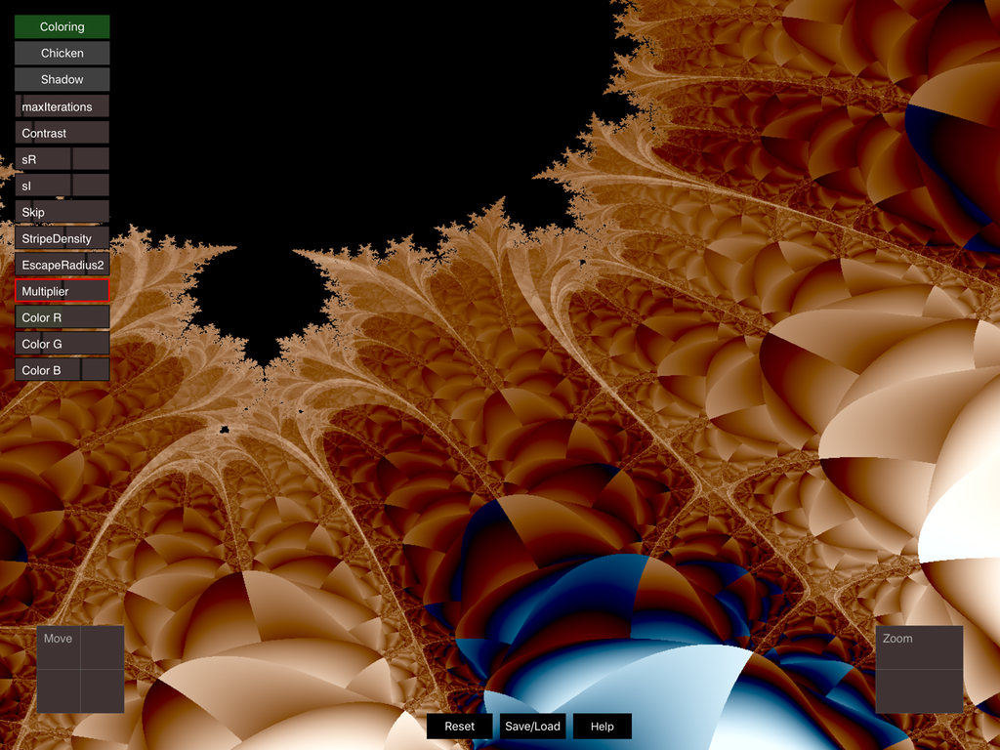

# BurningChicken
Fractal for IOS using Swift and Metal

Simple Mandelbrot viewer altered slightly to produce the famous Burning Chicken.

Visit: https://fractalforums.org/fractal-mathematics-and-new-theories/28/triangle-inequality-average-algorithm/1368

User 3DickUlus posted a beautiful image with the fragment shader attached.\
I copied the algorithm onto this app to do some experimentation.

